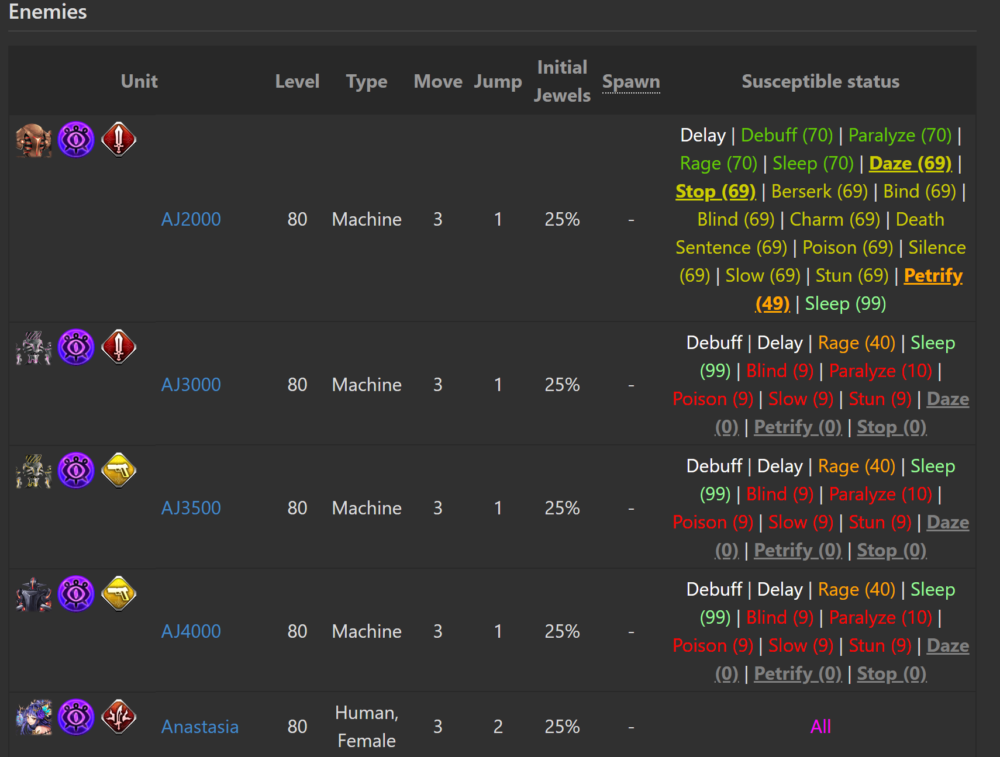

# ACDB Status Susceptibility Viewer (ACDBSSV)
View the status susceptibility of the quest units in the Alchemist Code Database

# Purpose
This extension was made to parse the quest page of the Alchemist Code Database (ACDB, http://www.alchemistcodedb.com/quest/*).

Download, modify to your liking, and install :)

The initial extension was made for the dark skin theme on ACDB so be sure to change the 'white' font for 100% susceptbility to black if you use the white theme.

Want a slim-down version for the statuses you care about? Edit the var Statuses to only include those entries of interest!

# Default values
## Note (Status reference)
The values of the skills are based on the resistance name from the units info (e.g. "Daze Res").

At the end portion of the extension, the " Res" portion comes off but it is vital that these portions remain when making references to the skill within the extension.

## Susceptibility Colouring
The first set of variables encounted (_Cutoff and _Color) are the colouring of the skills resisted in ascending order (going from least to most susceptible).

By default (with the __ part of the variable name in the parenthesis):
- Fully resistant (Susceptibility <= 0, var = noColor) = gray
- Very low susceptibility (0-19%) = red
- Low susceptibility (20-49%) = orange
- Mid susceptibility (50-69%) = #CCCC00 (dark yellow - brown)
- High susceptibility (70-79%) = #66CC00 (a dark shade of green that is still brighter than just 'green')
- Very high susceptibility (80-89%) = chartreuse (bright green)
- Highest susceptibility (90-99%) = pale green (a shade closer to being white than the other greens)
- **Fully susceptibile (100%) = white** (SET TO BLACK IF YOU'RE USING THE WHITE THEME)
- Susceptibile to all status OR fully susceptible important status = magenta

## Table element colouring
For debugging purposes, the default collapsed tables have the resistant stats coloured that were taken in to consideration.
- Dark red = Fully resistant
- Forest green = Partially resistant

The other entries were not taken in to consideration. If you want a term to be considered, add it to the Statuses variable.

## Statuses of interest
The importantStatuses defines what resistances you want highlighted.

By default, these terms will be bold and underlined.

If the enemy has no resistance, it will have the same colour as the defined "allColor".

If the enemy is fully resistant, unlike the other resistant statuses, it will appear at the end of the list with 0 appended.

# Example (truncated Veda Floor 41)

# Import unofficial version
If you made edits to the extension, you can import it through the following method:
## Chrome 
(for the 64-bit Version 66.0.3359.139 (Official Build))

1. Options (three dots) > More tools > Extensions (or go to chrome://extensions)
2. Enable Developer mode (top right)
3. Click "Load Unpacked" below the search bar
4. Select the extension folder.
5. Enable and you are done :)
6. (Recommended) Turn off Developer mode
Click the refresh icon if you make any changes to the extension after loading to update the extension.

## Firefox
(for FireFox 64-bit version 59.0.3)

1. Go to about:debugging
2. Select 'Load Temporary Add-on'
3. Select the folder

Done :)

# Questions
If you have any questions, do not hesitate to contact me on Discord (KuraiNorai#8889) or on Reddit (/u/KuraiNorai) though I do not go on often on the latter.
